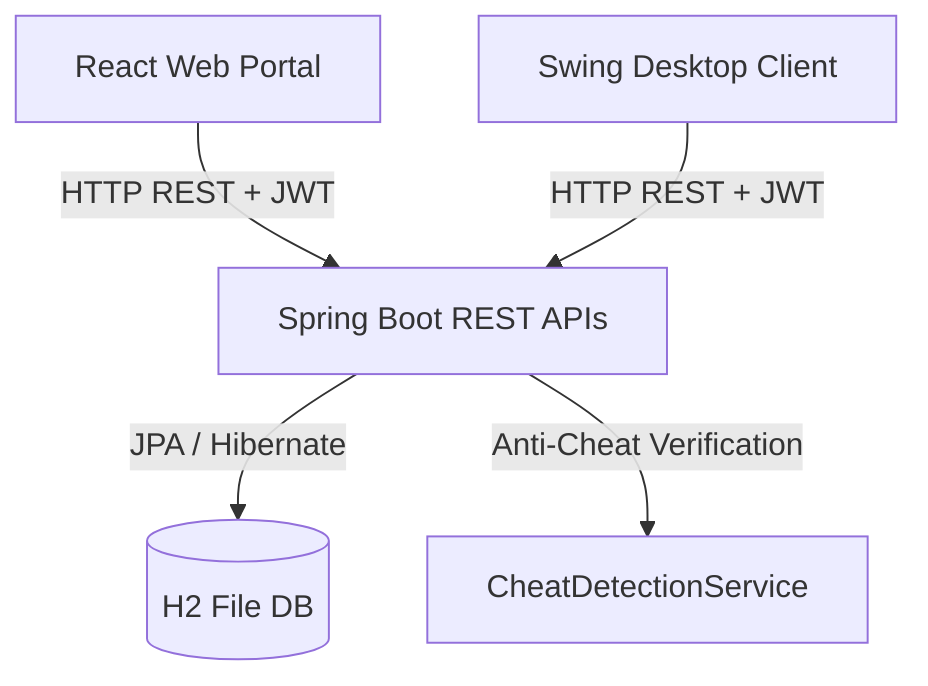

# 🍪 Cookie Clicker: Enterprise Edition Suite

Welcome to the **Cookie Clicker: Enterprise Edition Suite**, a highly-scalable, secure, full-stack recreation of the classic incremental clicker game. 

This repository replaces the legacy single-file Swing desktop application with a complete multi-client enterprise gaming architecture featuring a React web portal, a Spring Boot backend with robust security controls, and a modernized Java Swing client.

---

## 🏗️ System Architecture



### 1. Spring Boot Backend Service (`backend/`)
*   **Framework**: Spring Boot 3.3.4 (Java 21 LTS).
*   **Security & Auth**: Spring Security 6 implementing stateless JWT verification filters and secure BCrypt password encryption.
*   **Database Persistence**: Managed by Spring Data JPA connected to a file-persistent H2 Database engine (storing users and state records under `backend/data/cookie_clicker`).
*   **Security Shield (Anti-Cheat)**: A server-side `CheatDetectionService` that evaluates save transitions. It tracks clicks, timestamp delta, and upgrade production rates to reject mathematically anomalous updates or click-bot scripts.

### 2. React Web Dashboard Client (`frontend/`)
*   **Framework**: React 19 + TypeScript + Vite 6.
*   **Aesthetics**: Gorgeous dark glassmorphism dashboard with rotating vector SVG icons and floating click multipliers.
*   **HTML5 Sound Synth**: Leverages the browser **Web Audio API** to programmatically synthesize plucked, chiming, and major chord melodies in real time (requiring zero media downloads).
*   **Analytics**: Integrated SVG charts displaying Production Speed (CPS) growth graphs via **Recharts**.

### 3. Upgraded Swing Desktop Client (`desktop/`)
*   **Aesthetics**: Styled with the modern flat dark look using the **FlatLaf** library.
*   **Sync Logic**: Communicates with the backend using Java 11's asynchronous `java.net.http.HttpClient` to authenticate accounts and sync cookie balances.
*   **Offline Fallback**: Caches gameplay progress locally to `cookie_clicker_save.json` if the servers are offline.

---

## 🚀 How to Run the Applications

### Option A: Running with Docker (Recommended)
You can launch the complete full-stack environment in a single command using Docker:
1. Ensure you have **Docker** and **Docker Compose** installed.
2. In the root directory of this repository, run:
   ```bash
   docker-compose up --build
   ```
3. Open [http://localhost](http://localhost) in your browser to play the game! The backend runs concurrently on [http://localhost:8080](http://localhost:8080).

---

### Option B: Running Locally (Manual Build)

#### 1. Start the Backend API
1. Navigate to the backend directory:
   ```bash
   cd backend
   ```
2. Build and run using Maven:
   ```bash
   mvn spring-boot:run
   ```

#### 2. Start the React Frontend
1. Navigate to the frontend directory:
   ```bash
   cd frontend
   ```
2. Install npm packages and start the Vite server:
   ```bash
   npm install
   # Run local dev environment
   npm run dev
   ```
3. Open [http://localhost:5173](http://localhost:5173) in your browser.

#### 3. Start the Swing Desktop App
1. Navigate to the desktop directory:
   ```bash
   cd desktop
   ```
2. Run the client using Maven:
   ```bash
   mvn compile exec:java -Dexec.mainClass="com.cookieclicker.desktop.App"
   ```

---

## 🌐 Production Hosting Guidelines

Here are the recommended production deployment patterns for this architecture:

### 1. Frontend Web Dashboard
We recommend hosting the React static files on a global Content Delivery Network (CDN) for fast loading:
*   **Platforms**: **Vercel** (Recommended), **Netlify**, or **GitHub Pages**.
*   **Config**: Point to the `frontend/` directory, set the build command to `npm run build`, and configure the output directory as `dist`. Set the environment variable `VITE_API_URL` to point to your live backend domain.

### 2. Backend REST API
The Spring Boot web service can be hosted on containerized runtime instances:
*   **Platforms**: **Railway** (Recommended), **Render**, or **DigitalOcean App Platform**.
*   **Config**: Link your Git repository and deploy using the `backend/Dockerfile` we provided.
*   **Persistence**: If using H2 database files, attach a persistent volume (e.g., mapping `/app/data` inside the container to a storage block) to prevent data resets on service redeployment. Alternatively, configure database connection settings in `application.properties` to connect to a cloud PostgreSQL instance.
